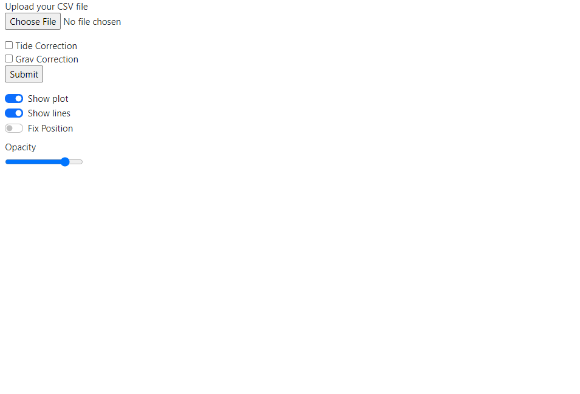
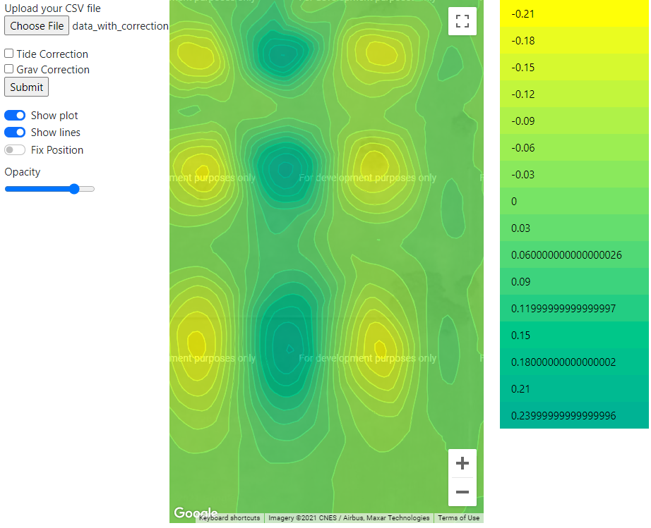
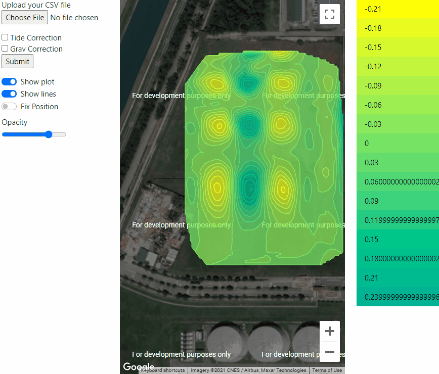
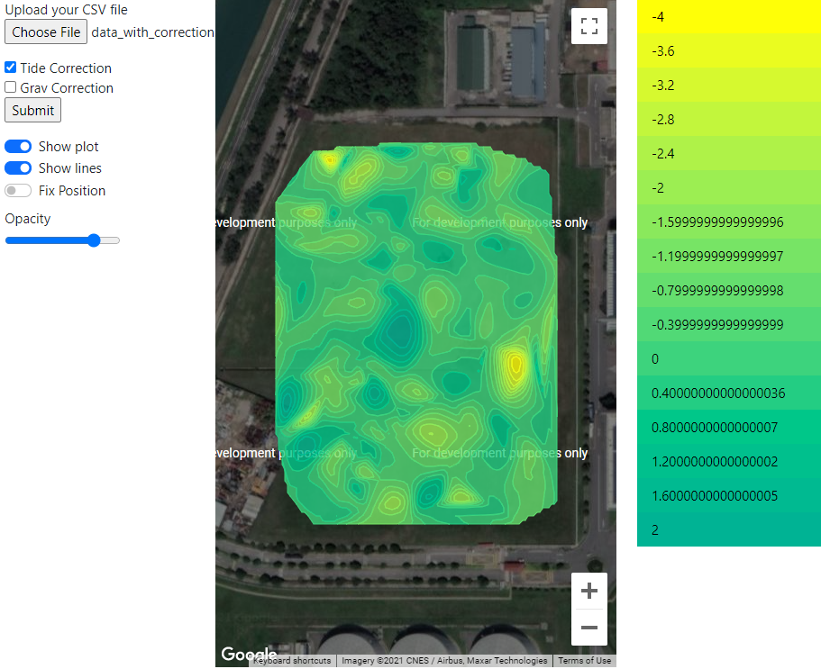
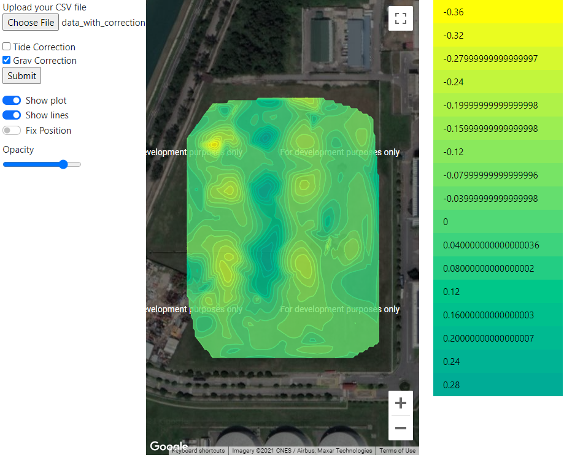
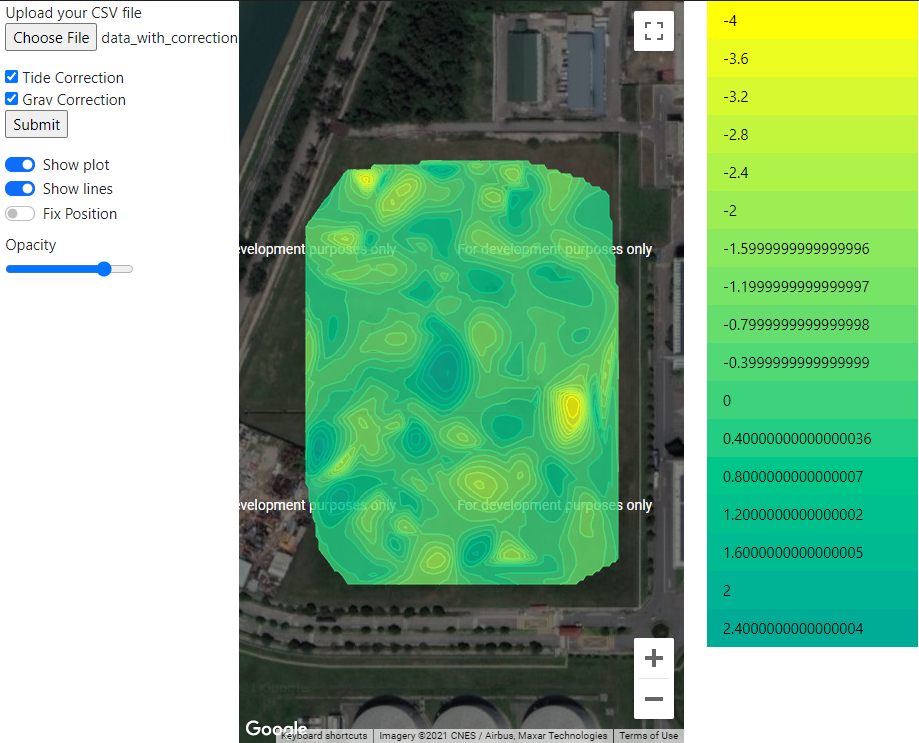

## Gravity Plotting using Google Maps API
### Dependencies: 
* Determined using pipreqs https://github.com/bndr/pipreqs 
* Requirements stored into requirements.txt 
* Install packages using "pip install -r requirements.txt"
* May require some admin privileges for installation (Command Prompt in admin mode)
<br/>
<br/>

### Usage:


* Navigate to the "Web" folder and run app.py.

* You should see this something like this
```
C:\Users\kwekz\PycharmProjects\ATAP\GravityPlot\Web>python app.py
 * Serving Flask app 'app' (lazy loading)
 * Environment: production
   WARNING: This is a development server. Do not use it in a production deployment.
   Use a production WSGI server instead.
 * Debug mode: on
 * Restarting with stat
 * Debugger is active!
 * Debugger PIN: 684-004-080
 * Running on http://127.0.0.1:5000/ (Press CTRL+C to quit)
```


<br/>
<br/>


* Open the link <http://127.0.0.1:5000/> in a browser, preferably Chrome. You should see the page below. 


<br/>
<br/>

* Click `Choose File` and select **data_with_correction.csv**. Then click `Submit`. You should see the map being loaded. 


<br/>
<br/>

* The map functions just like Google Maps. Click and drag to pan around. Use the scroll wheel to zoom in and out. 


* On the right is the colour bar which displays the weights of the different contours of the map. You can hover over the weights to highlight the corresponding contours.



* On the left is the opacity slider. Use it to adjust the opacity of the contours. 


<br/>
<br/>

 * Use the:
    * <kbd>Show plot</kbd> toggle to hide and display the contours
    * <kbd>Show lines</kbd> toggle to hide and display the lines
    * <kbd>Fix position</kbd> toggle to fix the centre coordinate so that newly loaded CSVs will not adjust the view of the map. 


<br/>
<br/>

### Corrections:
* You can select to apply different corrections using the checkboxes. Simply select the correction you want to apply and click `Submit`

* Tide correction selected.  


* Grav correction selected.  


* Both corrections selected.  


