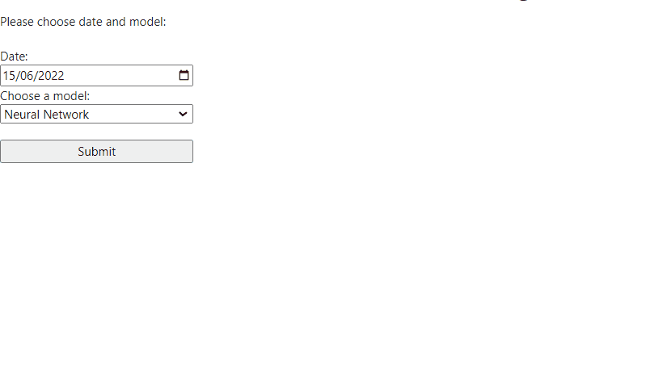

## Carpark prediction using Google Maps API
### Dependencies: 
* Determined using pipreqs https://github.com/bndr/pipreqs 
* Requirements stored into requirements.txt 
* Install packages using "pip install -r requirements.txt"
* May require other packages idk

* For Google Maps API to work full you need to supply your API key inside this line in index.js: src="https://maps.googleapis.com/maps/api/js?key={YOUR_API_KEY}&libraries=visualization,geometry"

* To run the app, just run app.py inside the Web folder. Should start up the app on http://127.0.0.1:5000/.

 
 

### Program flow:

* After running the app, you should seen this page on http://127.0.0.1:5000/.  

* Choose a desired date.  

* Choose either a neural network or decision tree model, then click `Submit`.  

* If you provide a valid API key, you can select between a *Map* or *Terrain* view.  

* Hover over the different time slots in the colour bar to display the predicted change in available car park slots. 

* The larger the circle, the greater the change. A red circle indicates outflow of cars, while green indates an inflow of cars, for each cluster.  

* You can also notice a difference in activity between weekday and weekends.  
